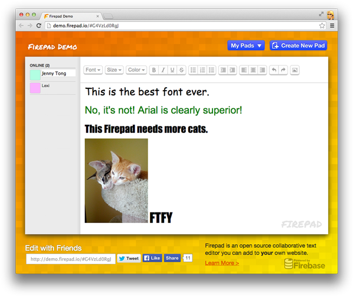

# Firepad [](https://travis-ci.org/firebase/firepad) [](https://coveralls.io/r/firebase/firepad) [](http://badge.fury.io/gh/firebase%2Ffirepad)

[Firepad](http://www.firepad.io/) is an open-source, collaborative code and text editor. It is
designed to be embedded inside larger web applications.

Join our [Firepad Google Group](https://groups.google.com/forum/#!forum/firepad-io) to ask
questions, request features, or share your Firepad apps with the community.


## Table of Contents

 * [Getting Started With Firebase](#getting-started-with-firebase)
 * [Live Demo](#live-demo)
 * [Downloading Firepad](#downloading-firepad)
 * [Documentation](#documentation)
 * [Examples](#examples)
 * [Contributing](#contributing)
 * [Repo Structure](#repo-structure)


## Getting Started With Firebase

Firepad requires [Firebase](https://firebase.google.com/) in order to sync and store data. Firebase
is a suite of integrated products designed to help you develop your app, grow your user base, and
earn money. You can [sign up here for a free account](https://console.firebase.google.com/).


## Live Demo

Visit [firepad.io](http://demo.firepad.io/) to see a live demo of Firepad in rich text mode, or the
[examples page](http://www.firepad.io/examples/) to see it setup for collaborative code editing.

[](http://demo.firepad.io/)


## Downloading Firepad

Firepad uses [Firebase](https://firebase.google.com) as a backend, so it requires no server-side
code. It can be added to any web app by including a few JavaScript files:

```HTML
<!-- Firebase -->
<script src="https://www.gstatic.com/firebasejs/3.0.3/firebase.js"></script>

<!-- CodeMirror -->
<script src="https://cdnjs.cloudflare.com/ajax/libs/codemirror/5.2.0/codemirror.js"></script>
<link rel="stylesheet" href="https://cdnjs.cloudflare.com/ajax/libs/codemirror/5.2.0/codemirror.css"/>

<!-- Firepad -->
<link rel="stylesheet" href="https://cdn.firebase.com/libs/firepad/1.4.0/firepad.css" />
<script src="https://cdn.firebase.com/libs/firepad/1.4.0/firepad.min.js"></script>
```

Then, you need to initialize the Firebase SDK and Firepad:

```HTML
<div id="firepad"></div>
<script>
  // Initialize the Firebase SDK
  firebase.initializeApp({
    apiKey: '<API_KEY>',
    databaseURL: 'https://<DATABASE_NAME>.firebaseio.com'
  });

  var firepadRef = firebase.database().ref();
  var codeMirror = CodeMirror(document.getElementById('firepad'), { lineWrapping: true });
  var firepad = Firepad.fromCodeMirror(firepadRef, codeMirror,
      { richTextShortcuts: true, richTextToolbar: true, defaultText: 'Hello, World!' });
</script>
```

## Documentation

Firepad supports rich text editing with [CodeMirror](http://codemirror.net/) and code editing via
[Ace](http://ace.c9.io/). Check out the detailed setup instructions at [firepad.io/docs](http://www.firepad.io/docs).


## Examples

You can find some Firepad examples [here](examples/README.md).


## Contributing

If you'd like to contribute to Firepad, please first read through our [contribution
guidelines](.github/CONTRIBUTING.md). Local setup instructions are available [here](.github/CONTRIBUTING.md#local-setup).


## Repo Structure

Here are some highlights of the directory structure and notable source files:

* `dist/` - output directory for all files generated by grunt (`firepad.js`, `firepad.min.js`, `firepad.css`, `firepad.eot`).
* `examples/` - examples of embedding Firepad.
* `font/` - icon font used for rich text toolbar.
* `lib/`
    * `firepad.js` - Entry point for Firepad.
    * `text-operation.js`, `client.js` - Heart of the Operation Transformation implementation.  Based on
      [ot.js](https://github.com/Operational-Transformation/ot.js/) but extended to allow arbitrary
      attributes on text (for representing rich-text).
    * `annotation-list.js` - A data model for representing annotations on text (i.e. spans of text with a particular
      set of attributes).
    * `rich-text-codemirror.js` - Uses `AnnotationList` to track annotations on the text and maintain the appropriate
      set of markers on a CodeMirror instance.
    * `firebase-adapter.js` - Handles integration with Firebase (appending operations, triggering retries,
      presence, etc.).
* `test/` - Jasmine tests for Firepad (many of these were borrowed from ot.js).
